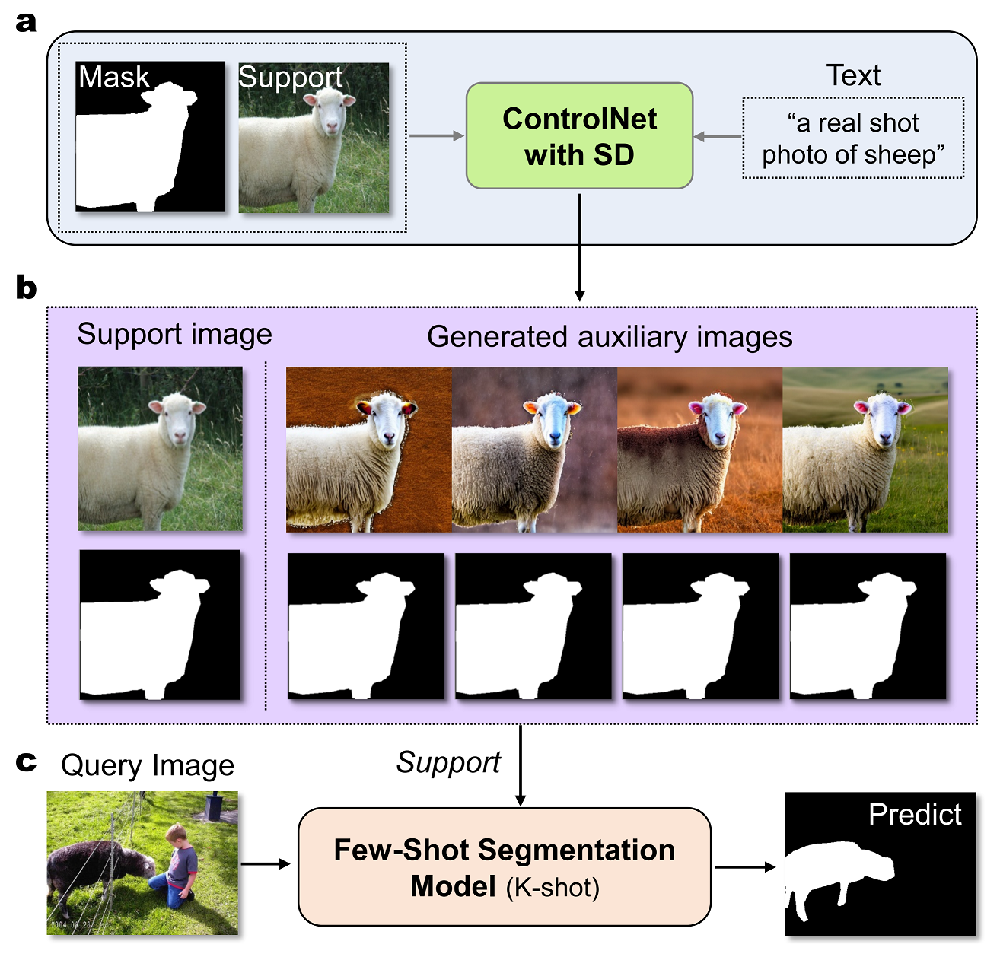

## DifFSS: Diffusion Model for Few-Shot Semantic Segmentation
This is the implementation of the [paper](https://arxiv.org/abs/2307.00773) "DifFSS: Diffusion Model for Few-Shot Semantic Segmentation".

  
 

## 1. Preparation of the auxiliary support images

Please refer to our [ControlNet4FSS](https://github.com/TrinitialChan/DifFSS-BAM) pipeline for the pre-generattion of auxiliary support images.

## 2. DifFSS on FSS models

The DifFSS method can be easily applied to existing FSS models, see one of our implementations on BAM [here](https://github.com/TrinitialChan/DifFSS-BAM).

